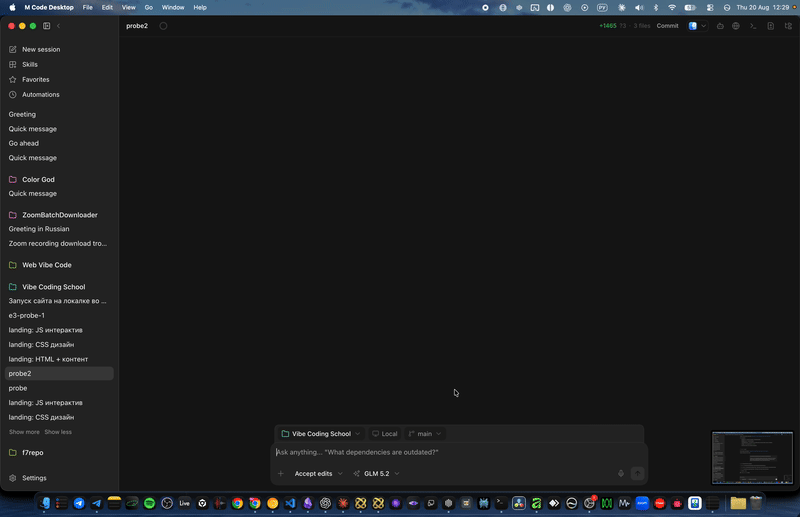
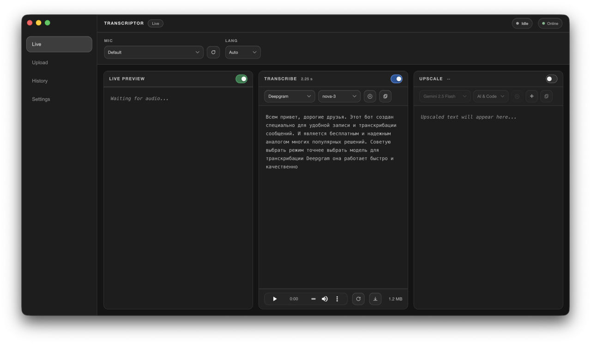
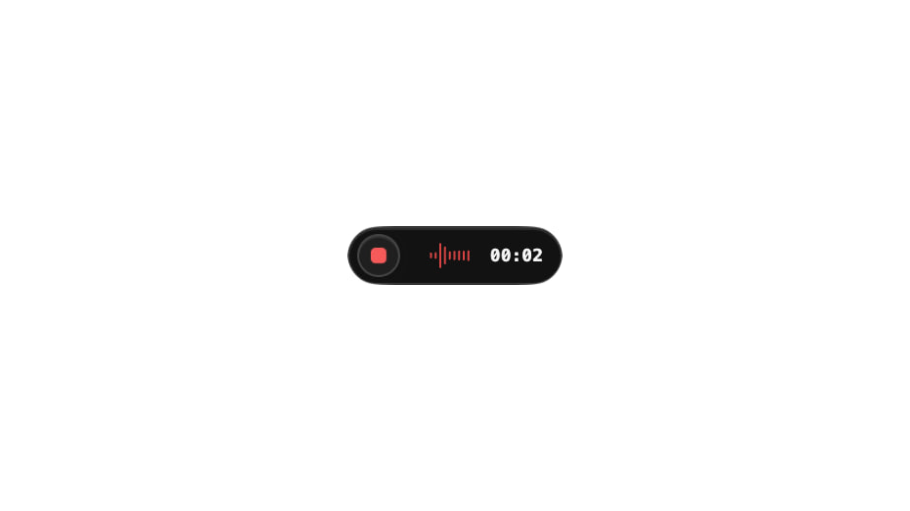

# Transcriptor

<p align="center">
  
</p>

Десктопное приложение для транскрибации речи: запись с микрофона, загрузка файлов, ИИ-очистка текста, локальная история, глобальные хоткеи, автовставка.

## Возможности

- **Живая транскрибация** — Local Whisper (офлайн) или Deepgram (облако).
- **Файловая транскрибация** — Whisper / Deepgram / OpenRouter.
- **История** — сохранённые транскрипты и исходный аудио, поиск, статистика, повторная транскрибация.
- **ИИ-апскейл** — пресеты через OpenRouter.
- **Автовставка** — результат сразу в фокусное поле (Enter после вставки — опционально).
- **Платформы** — macOS Apple Silicon, Windows x64, Linux x64.

## Режимы работы

### 1. Live — запись с микрофона в реальном времени

- Запуск: кнопка в интерфейсе, трей-меню или глобальный хоткей (`Option`+`←` / `F9`).
- Движки: **Local Whisper** (полностью офлайн, быстрее на Apple Silicon) или **Deepgram Nova-3** (облако, выше качество на шумных записях).
- Автоопределение пауз — сегменты фиксируются по тишине, финальный текст собирается без дублей.
- Индикатор здоровья микрофона (пилюля в топбаре): зелёно — звук есть, жёлто — тишина, красный — нет доступа/устройство занято.
- Результат сразу вставляется в фокусное поле (автовставка), копируется в буфер, сохраняется в историю.

### 2. Upload — загрузка своих аудио/видео файлов

- Перетащите файл в окно или нажмите «Загрузить».
- Поддерживаемые форматы: **аудио** — wav, mp3, m4a, flac, ogg, opus, webm; **видео** — mp4, mov, mkv, webm, avi (аудиодорожка извлекается автоматически).
- Лимит: **до 500 МБ** на файл.
- Движки: Local Whisper / Deepgram / OpenRouter (на выбор в настройках провайдера).
- Прогресс и статус видно в списке загрузок; по завершении — тот же пайплайн: автовставка, копирование, сохранение в историю.

### 3. История — всё, что вы записали или загрузили

- Каждая запись: текст, исходный аудио, метаданные (длительность, движок, дата, модель).
- Поиск по тексту, фильтр по движоку/дате.
- Действия: **открыть папку**, **повторно транскрибировать** (другой движок/модель), **ИИ-апскейл**, **удалить**.
- Статистика: общее время, количество сессий, использованные модели.

### 4. ИИ-апскейл (Upscale)

- Пресеты промптов через OpenRouter: «очистить от воды», «сделать протокол», «выделить задачи», «перевести», кастомный.
- Работает над любым текстом из истории.

## Скриншоты

<p align="center">
  
  
</p>


## Установка

> Готовых релизов на GitHub пока нет: сборки подписываются ad-hoc, а без
> Developer ID и нотаризации macOS заблокирует скачанное приложение. Пока
> что приложение собирается из исходников — см. [Разработка](#разработка).
> Команды ниже описывают установку **уже собранного** комплекта.

### macOS (Apple Silicon)

1. Возьмите `Transcriptor-<версия>-arm64-macos-install.zip` — его создаёт
   `./BUILD.command` в `desktop/dist/release/`.
2. Распакуйте и запустите `bash INSTALL_ON_OTHER_MAC.command`.
3. Разрешите **Микрофон**, **Universal Access**, **Автоматизацию** (Системные настройки → Приватность и безопасность).

### Windows x64

1. Возьмите `Transcriptor Setup <версия>.exe` из `desktop/dist/`
   (создаётся командой `npm --prefix desktop run dist:win`).
2. Запустите установщик.
3. Разрешите доступ к микрофону (Параметры → Приватность → Микрофон).

### Linux x64

```bash
sudo apt install xdotool wmctrl zenity
chmod +x Transcriptor-<версия>.AppImage
./Transcriptor-<версия>.AppImage
```

На Wayland — `wtype`/`ydotool` вместо `xdotool`.

## Глобальные хоткеи

| Действие | macOS | Windows / Linux |
|----------|-------|-----------------|
| Запись / Стоп | `Option`+`←` | `F9` |
| Вставить последний текст повторно | `Option`+`Shift`+`V` | `F10` |

Настройка: **Настройки → Ярлыки**. Красная подсветка = комбинация занята другой программой.

## Разработка

```bash
cd "Voice Transcriptor"

# macOS
./BUILD.command          # сборка DMG + замена установленного приложения

# Linux
./INSTALL.command

# Windows (из Git Bash / WSL / macOS хоста)
npm --prefix frontend ci
npm --prefix desktop ci
npm --prefix desktop run dist:win
```

### Запуск в dev-режиме

```bash
npm --prefix frontend ci
npm --prefix desktop ci
npm --prefix frontend run build
npm --prefix desktop run dev
```

Электрон сам управляет бэкендом — отдельный `uvicorn` не нужен.

## Конфигурация

```bash
cp .env.example .env
# отредактируйте .env при необходимости
```

Переменные: токен API, порт бэкенда, Deepgram хост, TTL результатов, Whisper-потоки, пути кэша и др. Полный список в `.env.example`.

## Траблшутинг

- **Логи**: `~/Library/Application Support/Transcriptor/main.log` (macOS) или `%APPDATA%\Transcriptor\main.log` (Windows).
- **Микрофон тишина**: переключите разрешение **Микрофон** выкл/вкл в настройках macOS или `tccutil reset Microphone local.transcriptor.app`.
- **Порт 8321 занят**: Electron сам выберет другой.

## Документация

- [PROJECT_STRUCTURE.md](PROJECT_STRUCTURE.md) — структура кода.
- [VERIFIED_AUDIT.md](docs/VERIFIED_AUDIT.md) — аудит багов и фиксы.
- [AUDIT_2026-08.md](docs/AUDIT_2026-08.md) — релиз-аудит: 30 дефектов с кодом и фиксами.
- [CHANGELOG.md](CHANGELOG.md) — история релизов.
- [INSTALL_OTHER_MAC.md](docs/INSTALL_OTHER_MAC.md) — установка внутренней сборки на другой Mac.

---

**English version:** [README.en.md](README.en.md)

## Поддержать проект

Если Transcriptor пригодился — можно сказать спасибо копейкой:

**USDT (TRC20)**
```
TVan3h93wZKeHt4Na4zsU3mVHnjpbKoghE
```

---

## Лицензия

MIT — свободное использование, модификация, распространение.
Автор: **Leo Erdman** (c) 2026
См. [LICENSE](LICENSE) и [NOTICE.md](NOTICE.md) — сторонние компоненты и
заявление о приватности.